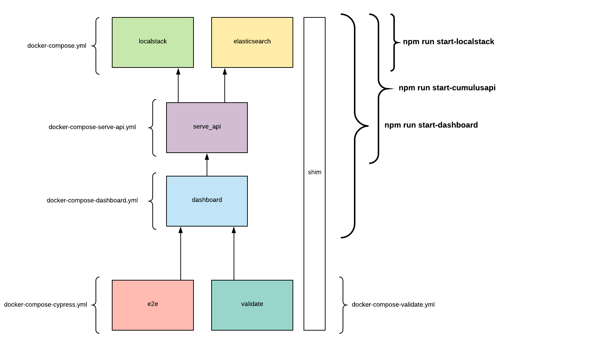

# Cumulus Dashboard

[](https://circleci.com/gh/nasa/cumulus-dashboard)

Code to generate and deploy the dashboard for the Cumulus API.

## Documentation

- [Usage](https://github.com/nasa/cumulus-dashboard/blob/master/USAGE.md)
- [Development Guide](https://github.com/nasa/cumulus-dashboard/blob/master/DEVELOPMENT.md)
- [Technical documentation on tables](https://github.com/nasa/cumulus-dashboard/blob/master/TABLES.md)

## Wireframes and mocks

- [Designs](ancillary/dashboard-designs.pdf)
- [Wireframes](ancillary/dashboard-wireframes.pdf)

## Configuration

The dashboard is populated from the Cumulus API. The dashboard has to point to a working version of the Cumulus API before it is installed and built.

The information needed to configure the dashboard is stored at `app/src/js/config/config.js`.

The following environment variables override the default values in `config.js`:

| Env Name | Description |
| -------- | ----------- |
| HIDE_PDR | whether to hide the PDR menu, default to true |
| DAAC\_NAME    | e.g. LPDAAC, default to Local |
| STAGE | e.g. UAT, default to development |
| LABELS | gitc or daac localization (defaults to daac) |
| APIROOT | the API URL. This must be set by the user as it defaults to example.com |
| AUTH_METHOD | The type of authorization method protecting the Cumulus API.  [launchpad or earthdata] Default: earthdata  |
| ENABLE\_RECOVERY | If true, adds recovery options to the granule and collection pages. default: false |
| KIBANAROOT | \<optional\> Should point to a Kibana endpoint. Must be set to examine distribution metrics details. |
| SHOW\_TEA\_METRICS | \<optional\> display metrics from Thin Egress Application (TEA). default: true |
| SHOW\_DISTRIBUTION\_API\_METRICS | \<optional\> Display metrics from Cumulus Distribution API. default: false |
| ESROOT | \<optional\> Should point to an Elasticsearch endpoint. Must be set for distribution metrics to be displayed. |
| ES\_USER | \<optional\> Elasticsearch username, needed when protected by basic authorization |
| ES\_PASSWORD | \<optional\> Elasticsearch password,needed when protected by basic authorization |


## Building or running locally

The dashboard uses node v10.16.3. To build/run the dashboard on your local machine, install [nvm](https://github.com/creationix/nvm) and run `nvm install v10.16.3`.

We use npm for local package management, to install the requirements:
```bash
  $ nvm use
  $ npm install
```

## Building the dashboard

### Building in Docker

The Cumulus Dashboard can be built inside of a Docker container, without needing to install any local dependencies.

```bash
  $ DAAC_NAME=LPDAAC STAGE=production HIDE_PDR=false LABELS=daac APIROOT=https://myapi.com ./bin/build_in_docker.sh
```

**NOTE**: Only the `APIROOT` environment variable is required.

The compiled files will be placed in the `dist` directory.

### <a name=buildlocally></a>Building locally

To build the dashboard:

```bash
  $ nvm use
  $ [SERVED_BY_CUMULUS_API=true] [DAAC_NAME=LPDAAC] [STAGE=production] [HIDE_PDR=false] [LABELS=daac] APIROOT=https://myapi.com npm run build
```
**NOTE**: Only the `APIROOT` environment variable is required.

#### Build the dashboard to be served by the Cumulus API.

With the Cumulus API it is possible to [serve the dashboard from an s3 Bucket](https://nasa.github.io/cumulus-api/#serve-the-dashboard-from-a-bucket).  If you wish to do this, you must build the dashboard with the environment variable `SERVED_BY_CUMULUS_API` set to `true`.  This configures the dashboard to work from the Cumulus `dashboard` endpoint.

The compiled files will be placed in the `dist` directory.

### Building a specific dashboard version

`cumulus-dashboard` versions are distributed using tags in GitHub. You can pull a specific version in the following manner:

```bash
  $ git clone https://github.com/nasa/cumulus-dashboard
  $ cd cumulus-dashboard
  $ git fetch origin ${tagNumber}:refs/tags/${tagNumber}
  $ git checkout ${tagNumber}
```

Then follow the steps noted above to build the dashboard locally or using Docker.

## Running the dashboard

### Running locally

To run the dashboard locally against a running Cumulus instance:

```bash
  $ git clone https://github.com/nasa/cumulus-dashboard
  $ cd cumulus-dashboard
  $ nvm use
  $ npm install
  $ APIROOT=https://myapi.com npm run serve
```

#### local API server

For **development** and **testing** purposes, you can run a Cumulus API locally. This requires `docker-compose` in order to stand up the docker containers that serve Cumulus API.  There are a number of commands that will stand up different portions of the stack.  See the [Docker Service Diagram](#dockerdiagram) and examine the `docker-compose*.yml` file in the `/localAPI/` directory to see all of the possible combinations. Described below are each of the provided commands for running the dashboard and Cumulus API locally.

*NOTE: These `docker-compose` commands do not build distributable containers, but are a provided as testing conveniences.  The docker-compose[-\*].yml files show that they work by linking your local directories into the container.*

In order to run the Cumulus API locally you must first [build the dashboard](#buildlocally) and then run the containers that provide LocalStack and Elasticsearch services.

These are started and stopped with the commands:
```bash
  $ npm run start-localstack
  $ npm run stop-localstack
```
After these containers are running, you can start a cumulus API locally in a terminal window `npm run serve-api`, the dashboard in another window. `[APIROOT=http://localhost:5001] npm run serve` and finally cypress in a third window. `npm run cypress`.

Once the docker app is running, If you would like to see sample data you can seed the database. This will load the same sample data into the application that is used during cypress testing.
```bash
  $ npm run seed-database
```

If you prefer to stand up more of the stack in docker containers, you can include the cumulus api in the docker-compose stack. To run the Cumulus API in a docker container, (which still leaves running the dashboard and cypress up to you), just run the `cumulusapi` service.

The cumulusapi docker service is started and stopped:
```bash
  $ npm run start-cumulusapi
  $ npm run stop-cumulusapi
```
Then you can run the dashboard locally (without docker) `[APIROOT=http://localhost:5001] npm run serve` and open cypress tests `npm run cypress`.


The docker compose stack also includes a command to let a developer start all development containers with a single command.

Bring up and down the entire stack (the localAPI and the dashboard) with:
```bash
  $ npm run start-dashboard
  $ npm run stop-dashboard
```
This runs everything, the backing Localstack and Elasticsearch containers, the local Cumulus API and dashboard.  Edits to your code will be reflected in the running dashboard.  You can run cypress tests still with `npm run cypress`.


##### Troubleshooting docker containers.

If something is not running correctly, or you're just interested, you can view the logs with a helper script, this will print out logs from each of the running docker containers.
```bash
  $ npm run view-docker-logs
```
This can be helpful in debugging problems with the docker application.

A common error is running the dashboard containers when the cumulus core unit-test-stack is running on your machine.  Just stop that stack and restart the dashboard stack to resolve.
```sh
ERROR: for localapi_shim_1  Cannot start service shim: driver failed programming external connectivity on endpoint localapi_shim_1 (7105603a4ff7fbb6f92211086f617bfab45d78cff47232793d152a244eb16feb): Bind for 0.0.0.0:9200 failed: port is already allocated

ERROR: for shim  Cannot start service shim: driver failed programming external connectivity on endpoint localapi_shim_1 (7105603a4ff7fbb6f92211086f617bfab45d78cff47232793d152a244eb16feb): Bind for 0.0.0.0:9200 failed: port is already allocated
```

#### Fully contained cypress testing.

You can run all of the cypress tests locally that circleCI runs with a single command:
```bash
  $ npm run e2e-tests
```
This will stands up the entire stack as well as begin the e2e service that will run all cypress commands and report an exit code for their success or failure.  This is primarily used for CircleCI, but can be useful to developers.

Likewise the validation tests can be run with this command:
```bash
  $ npm run validation-tests
```


#### <a name=dockerdiagram></a> Docker Container Service Diagram.


#### NGAP Sandbox Metrics Development

##### Kibana and Elasticsearch access

In order to develop features that interact with Kibana or Elasticsearch in the NGAP sandbox, you need to set up tunnels through the metric's teams bastion-host.  First you must get access to the metric's host. This will require a [NASD ticket](https://bugs.earthdata.nasa.gov/servicedesk/customer/portal/7/create/79) and permission from the metrics team.  Once you have access to the metrics-bastion-host you can get the IP addresses for the Bastion, Kibana and Elasticsearch from the metrics team and configure your `.ssh/config` file to create you local tunnels.  This configuration will open traffic to the Kibana endpoint on localhost:5601 and Elasticsearch on localhost:9201 tunneling traffic through the Bastion and Kibana machines.

```
Host metrics-bastion-host
  Hostname "Bastion.Host.Ip.Address"
  User ec2-user
  IdentitiesOnly yes
  IdentityFile ~/.ssh/your_private_bastion_key
Host metrics-elk-tunnels
  Hostname "Kibana.Host.IP.Address"
  IdentitiesOnly yes
  ProxyCommand ssh metrics-bastion-host -W %h:%p
  User ec2-user
  IdentityFile ~/.ssh/your_private_bastion_key
  # kibana
  LocalForward 5601 "Kibana.Host.IP.Address":5601
  # elastic search
  LocalForward 9201 "Elasticsearch.Host.IP.Address":9201
```

Now you can configure you sandbox environment with these variables.

```sh
export ESROOT=http://localhost:9201
export KIBANAROOT=http://localhost:5601
```

If the Elasticsearch machine is protected by basic authorization, the following two variables should also be set.

```sh
export ES_USER=<username>
export ES_PASSWORD=<password>
```


### Running locally in Docker

There is a script called `bin/build_docker_image.sh` which will build a Docker image
that runs the Cumulus dashboard.  It expects that the dashboard has already been
built and can be found in the `dist` directory.

The script takes one optional parameter, the tag that you would like to apply to
the generated image.

Example of building and running the project in Docker:

```bash
  $ ./bin/build_docker_image.sh cumulus-dashboard:production-1
  ...
  $ docker run -e PORT=8181 -p 8181:8181 cumulus-dashboard:production-1
```

In this example, the dashboard would be available at http://localhost:8181/.

## Deployment Using S3

First build the site

```bash
  $ nvm use
  $ DAAC_NAME=LPDAAC STAGE=production HIDE_PDR=false LABELS=daac APIROOT=https://myapi.com npm run build
```

Then deploy the `dist` folder

```bash
  $ aws s3 sync dist s3://my-bucket-to-be-used --acl public-read
```

## Tests

### Unit Tests

```bash
  $ npm run test
```

## Integration & Validation Tests

For the integration tests to work, you have to first run the localstack application, launch the localAPI and serve the dashboard first. Run the following commands in separate terminal sessions:

Run background localstack application.
```bash
  $ npm run start-localstack
```

Serve the cumulus API (separate terminal)
```bash
  $ npm run serve-api
```

Serve the dashboard web application (another terminal)
```bash
  $ [APIROOT=http://localhost:5001] npm run serve
```

If you're just testing dashboard code, you can generally run all of the above commands as a single docker-compose stack.
```bash
  $ npm run start-dashboard
```
This brings up LocalStack, Elasticsearch, the Cumulus localAPI, and the dashboard.

Run the test suite (yet another terminal window)
```bash
  $ npm run validate
  $ npm run cypress
```

When the cypress editor opens, click on `run all specs`.


## develop vs. master branches

The `master` branch is the branch where the source code of HEAD always reflects the latest product release. The `develop` branch is the branch where the source code of HEAD always reflects the latest merged development changes for the next release.  The `develop` branch is the branch where we should branch off.

When the source code in the develop branch reaches a stable point and is ready to be released, all of the changes should be merged back into master and then tagged with a release number.

## How to release

### 1. Checkout `develop` branch

We will make changes in the `develop` branch.

### 2. Create a new branch for the release

Create a new branch off of the `develop` branch for the release named `release-vX.X.X` (e.g. `release-v1.3.0`).

### 3. Update the version number

When changes are ready to be released, the version number must be updated in `package.json`.

### 4. Update the minimum version of Cumulus API if necessary

See the `minCompatibleApiVersion` value in `app/src/js/config/index.js`.

### 5. Update CHANGELOG.md

Update the CHANGELOG.md. Put a header under the 'Unreleased' section with the new version number and the date.

Add a link reference for the GitHub "compare" view at the bottom of the CHANGELOG.md, following the existing pattern. This link reference should create a link in the CHANGELOG's release header to changes in the corresponding release.

### 6. Update the version of the Cumulus API

If this release corresponds to a Cumulus Core package release, update the version of `@cumulus/api` to the latest package version so that the integration tests will run against that version.

### 7. Manual testing

Test the dashboard against a live API deployed with the latest Cumulus packages. The dashboard should be served from an S3 bucket through the [`/dashboard` API endpoint](https://nasa.github.io/cumulus-api/#serve-the-dashboard-from-a-bucket).

### 8. Create a pull request against the develop branch

Create a PR for the `release-vX.X.X` branch against the `develop` branch. Verify that the Circle CI build for the PR succeeds and then merge to `develop`.

### 9. Create a pull request against the master branch

Create a PR for the `develop` branch against the `master` branch. Verify that the Circle CI build for the PR succeeds and then merge to `master`.

### 10. Create a git tag for the release

Push a new release tag to Github. The tag should be in the format `v1.2.3`, where `1.2.3` is the new version.

Create and push a new git tag:

```bash
  $ git checkout master
  $ git tag -a v1.x.x -m "Release 1.x.x"
  $ git push origin v1.x.x
```

### 11. Add the release to GitHub

Follow the [Github documentation to create a new release](https://help.github.com/articles/creating-releases/) for the dashboard using the tag that you just pushed. Make sure to use the content from the CHANGELOG for this release as the description of the release on GitHub.
